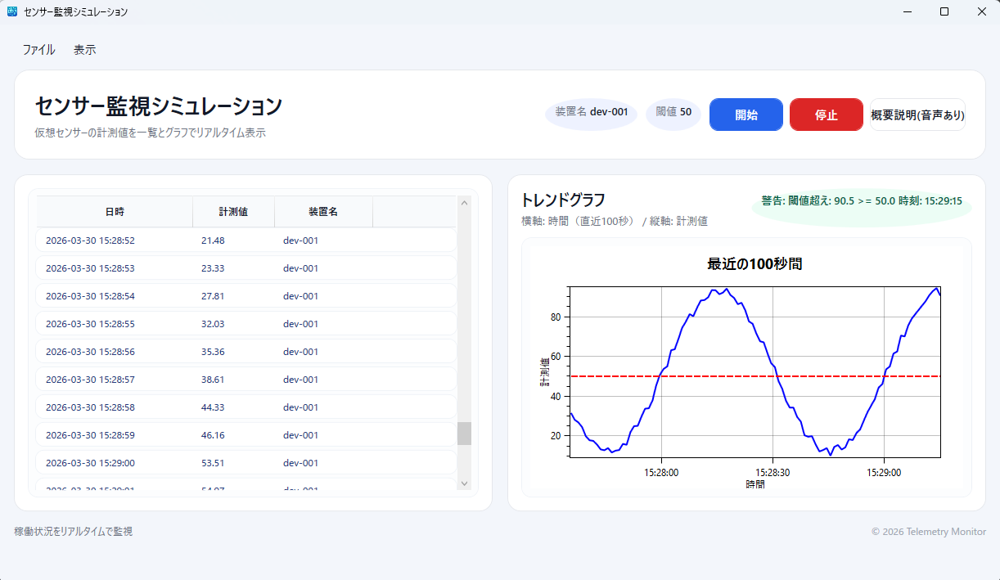
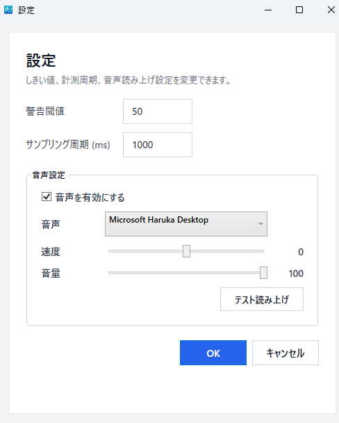
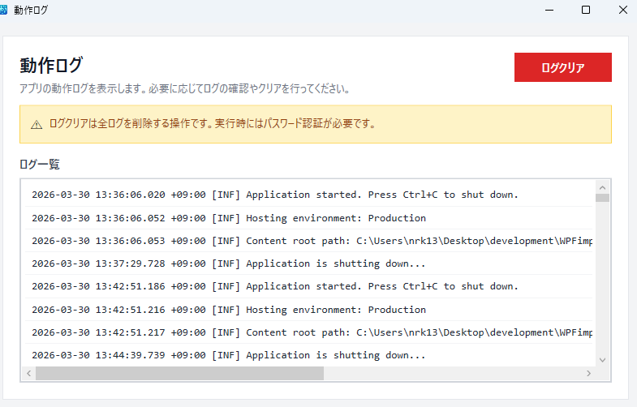
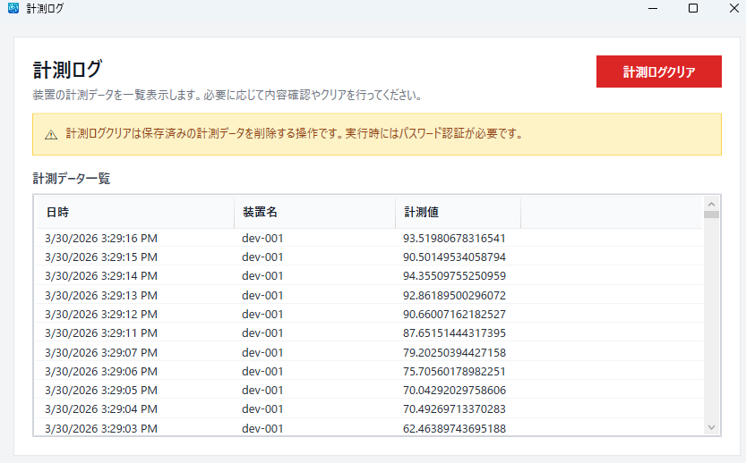
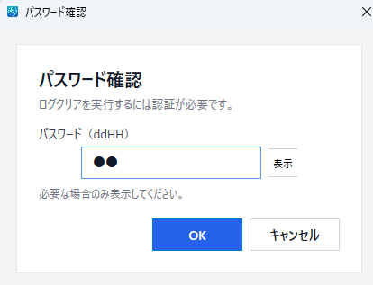
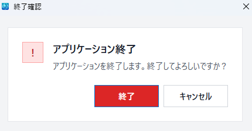

# センサー監視シミュレーション

[](https://github.com/fewioaghwrao/CsharpWpfTelemetryMonitor/actions/workflows/dotnet-tests.yml)

C# / .NET 8 / WPF で開発したデスクトップアプリケーションです。
仮想センサーの計測値をリアルタイムに監視し、しきい値判定・音声通知・ログ確認・CSVエクスポートまで行える構成にしています。

---

## 概要

本アプリは、仮想センサーから生成される計測データを一定周期で取得し、画面上に一覧とグラフで表示する監視アプリです。

しきい値を超えた場合は警告表示を行い、必要に応じて音声読み上げにも対応しています。また、計測ログや動作ログの確認、CSVエクスポート、重要操作時の確認ダイアログなど、実務アプリを意識した機能を取り入れています。

---

## 主な機能

- 仮想センサー値のリアルタイム監視
- 計測データの一覧表示
- OxyPlot を用いた折れ線グラフ表示
- しきい値超過時の警告表示
- 音声読み上げ通知
- 計測ログ確認
- 動作ログ確認
- CSVエクスポート
- 設定画面によるしきい値・周期・音声設定変更
- ログクリア時のパスワード確認
- アプリ終了時の確認ダイアログ

---

## 画面イメージ

### メイン画面

計測データの一覧表示と、直近データのトレンドグラフを同時に確認できます。
開始・停止操作、概要説明、しきい値超過時の警告表示にも対応しています。



---

### 設定画面

しきい値、サンプリング周期、音声設定を変更できます。
音声の有効化、使用音声、速度、音量の調整、およびテスト読み上げに対応しています。



---

### 動作ログ画面

アプリの起動・停止などの動作ログを確認できます。
ログクリアは重要操作として扱い、注意メッセージを表示しています。



---

### 計測ログ画面

保存済みの計測データを一覧で確認できます。
実務での確認画面を意識し、日時・装置名・計測値を表形式で表示しています。



---

### パスワード確認ダイアログ

ログクリアなどの重要操作では、パスワード確認ダイアログを表示する構成にしています。
単純なボタンクリックで削除できないようにし、誤操作防止を意識しました。



---

### 終了確認ダイアログ

アプリ終了時には確認ダイアログを表示し、意図しない終了を防止します。



---

## 使用技術

- C#
- .NET 8
- WPF
- MVVM
- CommunityToolkit.MVVM
- OxyPlot
- Serilog
- Microsoft.Data.Sqlite
- JSON 設定ファイル（appsettings.json）
- xUnit
- GitHub Actions

---

## 設計・実装上のポイント

### 1. 業務アプリを意識した画面構成

メイン画面だけでなく、設定画面・ログ画面・確認ダイアログまで含めて構成しました。
監視アプリで必要になりやすい「確認」「設定変更」「履歴参照」を一通り体験できるようにしています。

### 2. リアルタイム表示と一覧表示の両立

センサー値をリアルタイムに取得しつつ、一覧とグラフの両方で確認できるようにしています。
監視用途で必要になる「今の状態」と「直近の推移」の両方を把握しやすいUIを意識しました。

### 3. しきい値監視と通知

しきい値超過時には警告表示を行い、必要に応じて音声読み上げにも対応しています。
単なる表示にとどまらず、監視アプリらしい通知機能を実装しています。

### 4. ログ確認と運用を意識した作り

動作ログ・計測ログを分けて確認できるようにしました。
また、ログクリア時にはパスワード確認を挟むことで、誤操作防止も考慮しています。

### 5. 設定変更への対応

しきい値やサンプリング周期、音声設定を画面から変更できるようにしました。
運用時に設定変更しやすい構成を意識しています。

### 6. テストと継続的検証

Repository / ExportService / AlertService / SettingsViewModel の保存処理を対象に xUnit テストを追加しました。
また、GitHub Actions によりビルド・テストを自動実行できるようにし、変更時の確認を継続しやすい構成にしています。

---

## 推奨動作環境

### OS

- Windows 10 / Windows 11

### ランタイム

- .NET 8 Desktop Runtime

### ハードウェア

- CPU: Intel Core i3 以上
- メモリ: 4GB 以上
- ストレージ: 空き容量 500MB 以上

### 画面解像度

- 1280 × 800 以上推奨

---

## テスト / CI

以下のテストを xUnit で追加しています。

- Repository
- ExportService
- AlertService
- SettingsViewModel の保存処理

GitHub Actions により、push / pull request 時に自動でビルド・テストを実行する構成にしています。

---

## ビルド手順

### 前提条件

- Windows 10 / 11
- Visual Studio 2022 以降
- .NET 8 SDK

### 手順

```bash
git clone https://github.com/fewioaghwrao/CsharpWpfTelemetryMonitor.git
```

1. Visual Studio でソリューションを開く
2. NuGet パッケージを復元
3. Debug または Release でビルド
4. 実行ファイルを起動

### 実行手順

1. アプリを起動
2. メイン画面で監視を開始
3. 必要に応じて設定画面からしきい値や音声設定を変更
4. 計測ログ・動作ログを確認
5. CSVエクスポートでデータ保存

### 設定ファイル例

```json
{
  "AppSettings": {
    "SampleIntervalMs": 1000,
    "DatabasePath": "telemetry.db",
    "MaxInMemory": 2000,
    "AlertThreshold": 50.0
  }
}
```

---

## 今後の改善事項

- ViewModel の状態遷移テスト追加
- 入力値検証まわりのテスト追加
- UI 操作を含む画面テストの整理
- CSV出力処理の異常系テスト強化
- README への構成図・クラス構成の追記

---

## この成果物で伝えたいこと

このアプリでは、WPF を用いたデスクトップアプリ開発として以下を意識しました。

- 画面設計
- リアルタイム表示
- 設定変更機能
- ログ確認機能
- 誤操作防止のための確認ダイアログ
- 運用を意識した構成

単なるサンプル表示ではなく、業務アプリで求められる**画面・設定・確認・ログ確認の流れ**を意識して実装しています。

---

## 備考

本リポジトリはポートフォリオ公開用に作成したサンプルアプリケーションです。
WPF / .NET 8 を用いたデスクトップアプリ開発の実装例として掲載しています。